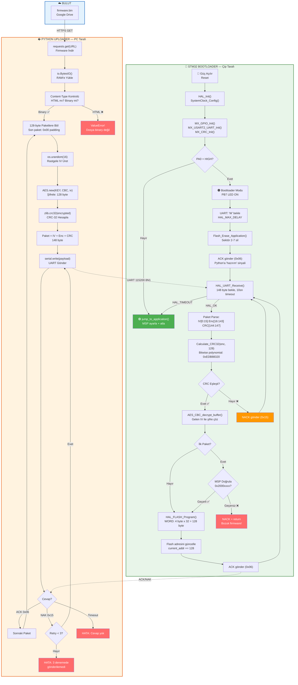
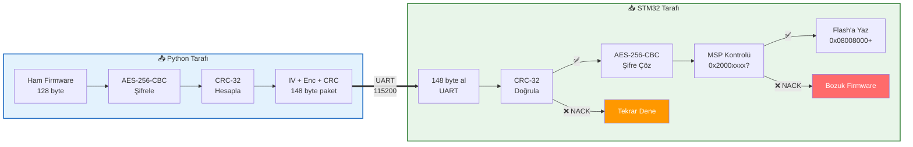
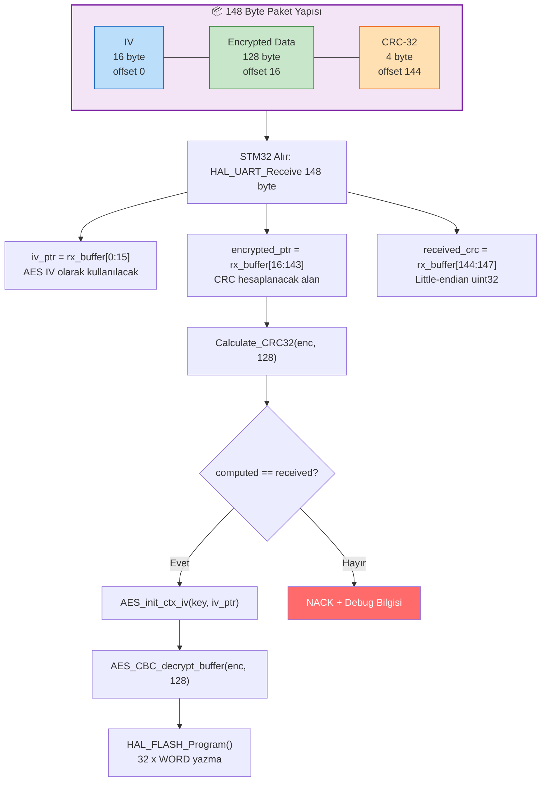
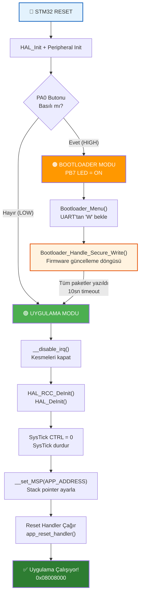
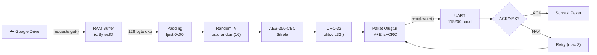

# 🔒 STM32 Secure Firmware Update (OTA-Ready)

> STM32F407VGT6 (Discovery Board) üzerinde **AES-256 şifreli**, **CRC-32 doğrulamalı** ve **bulut tabanlı** güvenli firmware güncelleme sistemi.

---

## 📋 İçindekiler

- [Proje Özeti](#-proje-özeti)
- [Sistem Mimarisi](#-sistem-mimarisi)
- [Genel İş Akışı](#-genel-iş-akışı)
- [Donanım](#-donanım)
- [Yazılım Bileşenleri](#-yazılım-bileşenleri)
- [Flash Bellek Haritası](#-flash-bellek-haritası)
- [Paket Protokolü](#-paket-protokolü)
- [Güvenlik Katmanları](#-güvenlik-katmanları)
- [Dosya Yapısı ve Açıklamaları](#-dosya-yapısı-ve-açıklamaları)
- [Kurulum ve Kullanım](#-kurulum-ve-kullanım)
- [Kullanılan Kütüphaneler](#-kullanılan-kütüphaneler)
- [Mevcut Durum](#-mevcut-durum)

---

## 🎯 Proje Özeti

Bu proje, mikrodenetleyici üzerinde çalışan bir uygulamanın **güvenli bir şekilde uzaktan güncellenmesini** sağlar. Sistem iki ana bileşenden oluşur:

| Bileşen | Açıklama |
|---------|----------|
| **Custom Bootloader** (C — STM32) | Çipin açılışında çalışır, firmware paketlerini alır, doğrular, şifresini çözer ve Flash'a yazar |
| **Uploader** (Python — PC) | Firmware dosyasını buluttan indirir, AES-256 ile şifreler, CRC-32 ekler ve seri port üzerinden STM32'ye gönderir |

---

## 🏗 Sistem Mimarisi

```
┌─────────────────────────────────────────────────────────┐
│                    BULUT (Google Drive)                  │
│                   firmware.bin dosyası                   │
└──────────────────────┬──────────────────────────────────┘
                       │ HTTPS GET
                       ▼
┌─────────────────────────────────────────────────────────┐
│              PYTHON UPLOADER (PC Tarafı)                │
│                                                         │
│  1. Firmware'ı indir (RAM'e al, diske yazmadan)         │
│  2. 128-byte paketlere böl                              │
│  3. Her pakete rastgele IV üret                         │
│  4. AES-256-CBC ile şifrele                             │
│  5. Şifreli veri üzerinden CRC-32 hesapla               │
│  6. [IV + Encrypted + CRC] olarak UART'tan gönder       │
└──────────────────────┬──────────────────────────────────┘
                       │ UART (115200 baud, 8N1)
                       ▼
┌─────────────────────────────────────────────────────────┐
│           STM32 CUSTOM BOOTLOADER (Çip Tarafı)          │
│                                                         │
│  1. PA0 butonuna bak → Bootloader mı, uygulama mı?     │
│  2. 'W' komutu bekle → Flash'ı sil                      │
│  3. 148-byte paket al → CRC doğrula                     │
│  4. AES-256-CBC şifre çöz (gelen IV ile)                │
│  5. MSP doğrula (ilk paket)                             │
│  6. Flash'a yaz (0x08008000+)                           │
│  7. Timeout → Uygulamaya atla                           │
└─────────────────────────────────────────────────────────┘
```

---

## 🔄 Genel İş Akışı — Uçtan Uca



---

## 🔐 Güvenlik Doğrulama Zinciri



---

## 📦 Paket İşleme Detayı



---

## ⚡ Bootloader Açılış Karar Ağacı



---

## 🔩 Donanım

| Bileşen | Model | Açıklama |
|---------|-------|----------|
| **MCU** | STM32F407VGT6 | ARM Cortex-M4, 168 MHz, 1MB Flash, 192KB RAM |
| **Board** | STM32F4 Discovery | Dahili ST-Link debugger |
| **Kristal** | 8 MHz HSE | PLL ile 168 MHz'e çıkarılıyor |
| **UART** | USART2 (PA2/PA3) | 115200 baud, 8N1 |
| **Buton** | PA0 (User Button) | HIGH = Bootloader, LOW = Uygulama |
| **LED'ler** | PB5, PB6, PB7 | Durum göstergeleri |
| **USB-Serial** | Herhangi (CP2102, CH340, FTDI) | PC ile UART haberleşme |

### Pin Yapılandırması

| Pin | Fonksiyon | Yön | Açıklama |
|-----|-----------|-----|----------|
| PA0 | GPIO Input | IN | Bootloader tetikleme butonu |
| PA2 | USART2_TX | AF | Seri veri gönderme |
| PA3 | USART2_RX | AF | Seri veri alma |
| PB5 | GPIO Output | OUT | Durum LED |
| PB6 | GPIO Output | OUT | CRC başarı LED |
| PB7 | GPIO Output | OUT | Bootloader aktif LED |
| PD13 | GPIO Output | OUT | Genel durum LED |

---

## 📦 Yazılım Bileşenleri

### 1. Custom Bootloader (STM32 — C)

#### `main.c` — Ana Program

| Fonksiyon | Satır | Görevi |
|-----------|-------|--------|
| `main()` | 104 | Peripheral init, buton kontrolü, bootloader/uygulama kararı |
| `SystemClock_Config()` | 159 | HSE + PLL → 168 MHz saat yapılandırması |
| `Calculate_CRC32()` | 201 | Yazılımsal CRC-32 (polynomial: `0xEDB88320`, bitwise) |
| `Bootloader_Menu()` | 217 | UART'tan 'W' komutu bekler, Secure Write'ı başlatır |
| `Bootloader_Handle_Secure_Write()` | 233 | Paket alma, CRC doğrulama, AES çözme, Flash yazma döngüsü |
| `jump_to_application()` | 302 | MSP ayarla, kesmeler kapat, uygulama Reset_Handler'a atla |
| `Flash_Erase_Application()` | 315 | Sektör 2-7 silme (uygulama alanı) |

#### `aes.c` / `aes.h` — AES-256 Şifreleme Modülü

| Fonksiyon | Görevi |
|-----------|--------|
| `AES_init_ctx_iv()` | AES context'i key ve IV ile başlat, key expansion yap |
| `AES_CBC_decrypt_buffer()` | CBC modunda blok blok şifre çöz |
| `KeyExpansion()` | 256-bit key'den 15 round key türet (AES-256 = 14 round) |
| `InvCipher()` | Tek blok (16 byte) AES ters şifreleme |

> Saf C implementasyonu, harici kütüphane kullanılmaz. S-Box ve Inverse S-Box tabloları dahildir.

#### `usart.c` — UART Yapılandırması

| Parametre | Değer |
|-----------|-------|
| Instance | USART2 |
| Baud Rate | 115200 |
| Word Length | 8 bit |
| Stop Bits | 1 |
| Parity | None |
| Flow Control | None |

#### `gpio.c` — GPIO Yapılandırması

PA0 (Input, No Pull), PB5/6/7 (Output), PD13 (Output) konfigürasyonu.

#### `crc.c` — Donanım CRC Modülü

HAL CRC modülü init (kullanılmıyor, yazılımsal CRC tercih edildi).

---

### 2. Python Uploader (PC)

#### `uploder.py` — Firmware Yükleyici



| Fonksiyon / Değişken | Görevi |
|----------------------|--------|
| `upload_from_cloud()` | Ana akış: indir → şifrele → gönder |
| `calculate_crc32()` | `zlib.crc32()` wrapper |
| `BIN_FILE_URL` | Google Drive direct download linki |
| `KEY` | AES-256 anahtarı (32 byte) |
| `PACKET_SIZE` | 128 byte (AES blok çarpanı) |
| `MAX_RETRIES` | Paket başına maksimum tekrar deneme: 3 |

---

## 💾 Flash Bellek Haritası

```
STM32F407VGT6 — 1 MB Flash
┌──────────────────────────────────────────┐
│ 0x08000000  ┌─────────────────────────┐  │
│             │    BOOTLOADER (32 KB)    │  │  Sektör 0-1
│             │    Custom bootloader     │  │  Linker: LENGTH = 32K
│ 0x08008000  ├─────────────────────────┤  │
│             │                         │  │
│             │   UYGULAMA ALANI        │  │  Sektör 2-7
│             │   (Kullanıcı firmware)   │  │  ~992 KB
│             │                         │  │
│ 0x080FFFFF  └─────────────────────────┘  │
└──────────────────────────────────────────┘
```

| Alan | Başlangıç | Bitiş | Boyut | İçerik |
|------|-----------|-------|-------|--------|
| Bootloader | `0x08000000` | `0x08007FFF` | 32 KB | Custom bootloader kodu + vektör tablosu |
| Uygulama | `0x08008000` | `0x080FFFFF` | ~992 KB | Güncellenen firmware |

### Linker Script Özeti (`STM32F407VGTX_FLASH.ld`)

```
MEMORY {
    CCMRAM (xrw) : ORIGIN = 0x10000000, LENGTH = 64K
    RAM    (xrw) : ORIGIN = 0x20000000, LENGTH = 128K
    FLASH  (rx)  : ORIGIN = 0x08000000, LENGTH = 32K   ← Sadece bootloader
}
```

---

## 📡 Paket Protokolü

### Haberleşme Akışı

```
PC (Python)                          STM32 (Bootloader)
    │                                        │
    │──── 'W' (1 byte) ────────────────────►│
    │                                        │── Flash Erase
    │◄──── ACK (0x06) ──────────────────────│
    │                                        │
    │──── Paket 1 (148 byte) ──────────────►│
    │                                        │── CRC doğrula
    │                                        │── AES çöz
    │                                        │── Flash'a yaz
    │◄──── ACK (0x06) ──────────────────────│
    │                                        │
    │──── Paket 2 (148 byte) ──────────────►│
    │◄──── ACK (0x06) ──────────────────────│
    │                                        │
    │──── ... (N paket) ... ───────────────►│
    │                                        │
    │         (10sn timeout)                 │
    │                                        │── jump_to_application()
```

### Paket Yapısı (148 Byte)

```
┌──────────┬─────────────────────────┬────────────┐
│  IV      │    Encrypted Data       │    CRC-32  │
│ 16 byte  │      128 byte           │   4 byte   │
│ random   │   AES-256-CBC           │  little-   │
│          │                         │  endian    │
└──────────┴─────────────────────────┴────────────┘
  offset 0       offset 16              offset 144
```

| Alan | Boyut | Açıklama |
|------|-------|----------|
| **IV** | 16 byte | Her paket için `os.urandom(16)` ile üretilen rastgele Initialization Vector |
| **Encrypted Data** | 128 byte | AES-256-CBC ile şifrelenmiş firmware verisi |
| **CRC-32** | 4 byte | Şifreli verinin (128 byte) CRC-32 checksum'ı (little-endian) |

### Kontrol Kodları

| Kod | Hex | Anlamı |
|-----|-----|--------|
| ACK | `0x06` | Paket başarıyla alındı ve işlendi |
| NACK | `0x15` | Paket reddedildi (CRC hatası veya MSP geçersiz) |

---

## 🔐 Güvenlik Katmanları

### 1. AES-256-CBC Şifreleme

| Parametre | Değer |
|-----------|-------|
| Algoritma | AES (Rijndael) |
| Anahtar Uzunluğu | 256 bit (32 byte) |
| Mod | CBC (Cipher Block Chaining) |
| IV | Her paket için rastgele (16 byte) |
| Padding | Sıfır padding (0x00) |
| Round Sayısı | 14 |

**IV Stratejisi:** Her paket kendi rastgele IV'si ile şifrelenir ve IV paketin başında gönderilir. Bu, aynı firmware verisi bile olsa her gönderimde farklı şifreli çıktı üretilmesini sağlar (replay attack koruması).

### 2. CRC-32 Bütünlük Kontrolü

| Parametre | Değer |
|-----------|-------|
| Polynomial | `0xEDB88320` (reflected) |
| Initial Value | `0xFFFFFFFF` |
| Final XOR | `0xFFFFFFFF` |
| Hesaplama Alanı | Şifreli veri (128 byte) |
| Uyumluluk | Python `zlib.crc32()` ile birebir uyumlu |

### 3. MSP Doğrulaması

İlk paketin ilk 4 byte'ı Main Stack Pointer (MSP) değerini içerir. Bu değer STM32F4 RAM aralığında (`0x2000xxxx`) olmalıdır. Geçersiz MSP = bozuk firmware.

---

## 📂 Dosya Yapısı ve Açıklamaları

```
FirmwareUpdate/
├── README.md                          ← Bu dosya
├── Custom bootloader/                 ← STM32CubeIDE Projesi
│   ├── Core/
│   │   ├── Inc/
│   │   │   ├── main.h                 ← Ana başlık, HAL include
│   │   │   ├── aes.h                  ← AES_ctx struct, fonksiyon prototipleri
│   │   │   ├── crc.h                  ← CRC handle extern
│   │   │   ├── gpio.h                 ← GPIO fonksiyon prototipleri
│   │   │   ├── usart.h                ← UART handle extern
│   │   │   ├── stm32f4xx_hal_conf.h   ← HAL modül seçimi
│   │   │   └── stm32f4xx_it.h         ← Interrupt handler prototipleri
│   │   ├── Src/
│   │   │   ├── main.c                 ← ⭐ Bootloader ana mantığı
│   │   │   ├── aes.c                  ← ⭐ AES-256 yazılımsal implementasyon
│   │   │   ├── crc.c                  ← HAL CRC init
│   │   │   ├── gpio.c                 ← GPIO pin konfigürasyonu
│   │   │   ├── usart.c                ← UART konfigürasyonu (115200, 8N1)
│   │   │   ├── stm32f4xx_hal_msp.c    ← HAL MSP callbacks
│   │   │   ├── stm32f4xx_it.c         ← Interrupt handlers
│   │   │   ├── system_stm32f4xx.c     ← System init
│   │   │   ├── syscalls.c             ← Newlib syscalls
│   │   │   └── sysmem.c               ← Memory management
│   │   └── Startup/
│   │       └── startup_stm32f407vgtx.s ← Startup assembly, vektör tablosu
│   ├── Drivers/                        ← STM32 HAL kütüphanesi
│   ├── STM32F407VGTX_FLASH.ld         ← ⭐ Linker script (32K bootloader)
│   ├── Custom bootloader.ioc          ← STM32CubeMX konfigürasyonu
│   └── Debug/                          ← Derleme çıktıları
│       └── Custom bootloader.map      ← Linker map dosyası
└── Uploader/
    └── uploder.py                     ← ⭐ Python firmware yükleyici
```

---

## 🚀 Kurulum ve Kullanım

### Gereksinimler

**PC Tarafı:**
```bash
pip install pyserial pycryptodome requests
```

**STM32 Tarafı:**
- STM32CubeIDE (v1.19.0+)
- ST-Link sürücüleri

### Adımlar

1. **Bootloader'ı Flash'la:**
   ```
   STM32CubeIDE → Custom bootloader projesi → Build (Ctrl+B) → Debug/Run (F11)
   ```

2. **Firmware .bin dosyasını hazırla:**
   - Uygulama projesi linker'ında `FLASH ORIGIN = 0x08008000` olmalı
   - `.bin` formatında export et
   - Google Drive'a yükle (direct download link al)

3. **Python Uploader'ı çalıştır:**
   ```bash
   cd Uploader
   python uploder.py
   ```

4. **Bootloader'ı tetikle:**
   - STM32'de PA0 butonunu basılı tutarak reset at
   - UART terminalinde "Bootloader Beklemede" mesajı görünmeli

---

## 📚 Kullanılan Kütüphaneler

### STM32 (C)

| Modül | Kaynak | Açıklama |
|-------|--------|----------|
| STM32F4xx HAL | STMicroelectronics | Donanım Abstraction Layer |
| CMSIS | ARM | Cortex-M çekirdek erişimi |
| AES-256 | Özel (tiny-AES-c bazlı) | Yazılımsal AES şifreleme/çözme |
| CRC-32 | Özel (bitwise) | `0xEDB88320` polynomial ile yazılımsal CRC |

### Python

| Modül | Versiyon | Açıklama |
|-------|----------|----------|
| `serial` (pyserial) | 3.5+ | Seri port haberleşme |
| `pycryptodome` | 3.20+ | AES-256-CBC şifreleme (`Crypto.Cipher.AES`) |
| `requests` | 2.31+ | HTTP GET ile firmware indirme |
| `zlib` | stdlib | CRC-32 hesaplama |
| `io` | stdlib | RAM tabanlı BytesIO buffer |
| `os` | stdlib | `os.urandom()` ile kriptografik IV üretimi |

---

## 📊 Mevcut Durum

### ✅ Tamamlanan Aşamalar

| # | Aşama | Durum |
|---|-------|-------|
| 1 | Bootloader bellek haritası ve linker konfigürasyonu | ✅ |
| 2 | Buton ile bootloader/uygulama seçimi (PA0) | ✅ |
| 3 | UART haberleşme altyapısı (115200, 8N1) | ✅ |
| 4 | Flash erase (Sektör 2-7) | ✅ |
| 5 | AES-256-CBC yazılımsal implementasyonu | ✅ |
| 6 | Python tarafı: buluttan indirme + şifreleme + gönderme | ✅ |
| 7 | Paket protokolü: IV + Encrypted + CRC (148 byte) | ✅ |
| 8 | Yazılımsal CRC-32 (bitwise, zlib uyumlu) | ✅ |
| 9 | MSP doğrulaması (ilk paket) | ✅ |
| 10 | Flash'a yazma (word programlama) | ✅ |
| 11 | Timeout ile uygulamaya atlama | ✅ |
| 12 | Retry mekanizması (3 deneme) | ✅ |


