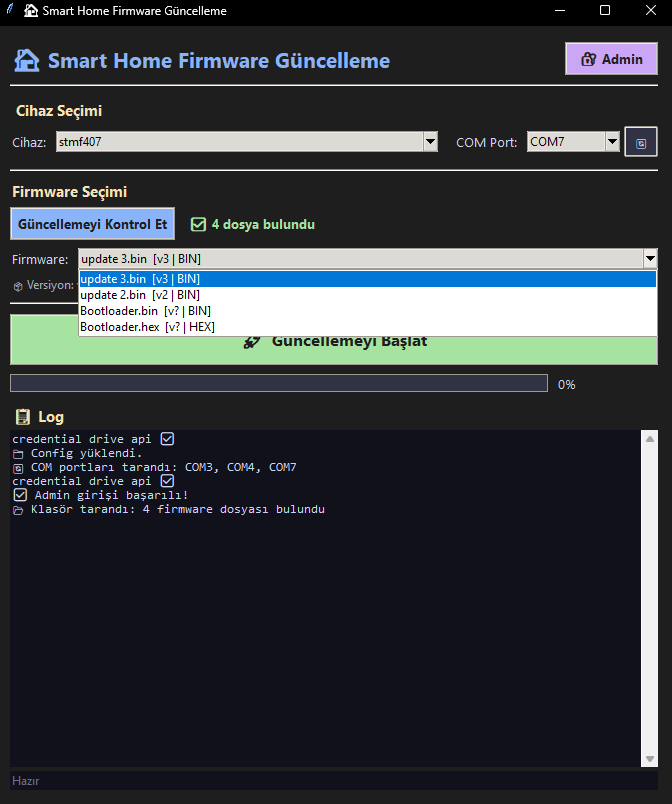
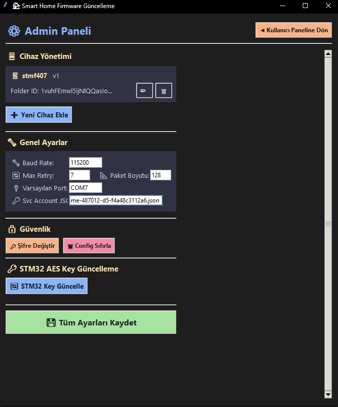
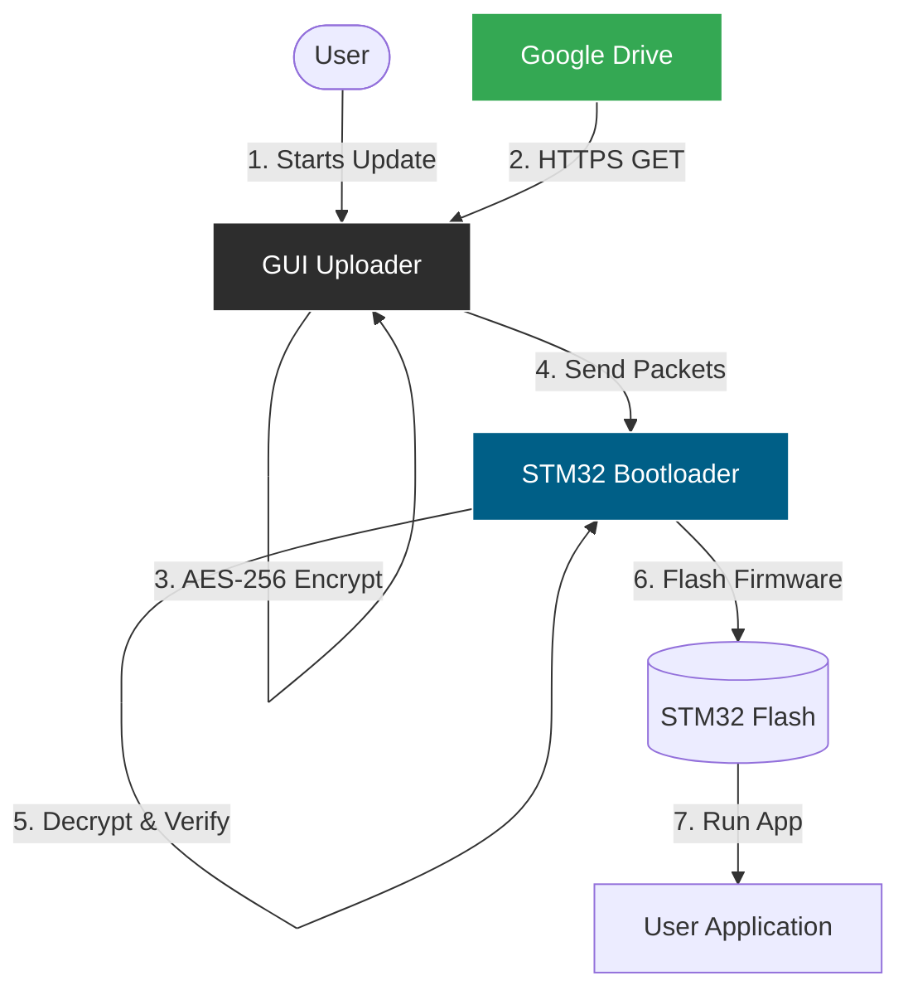
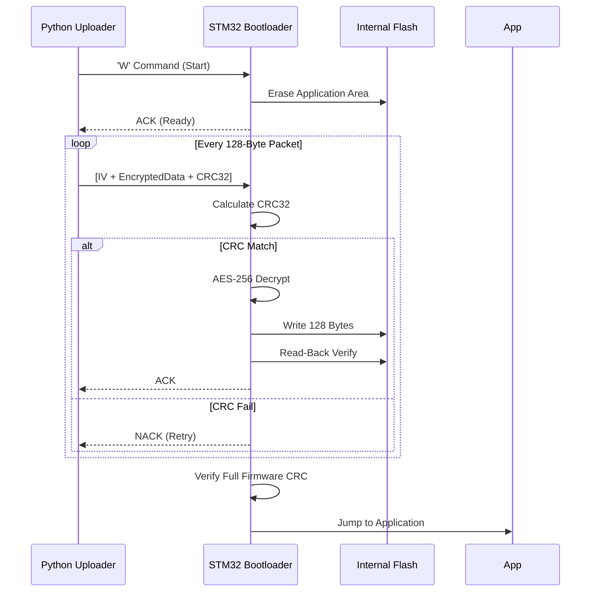
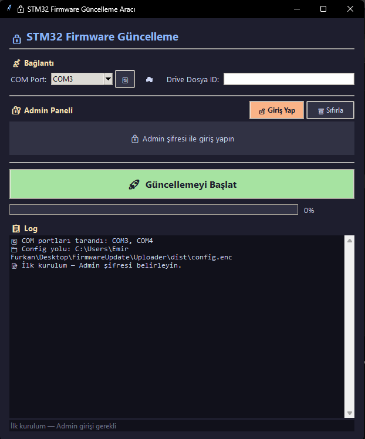
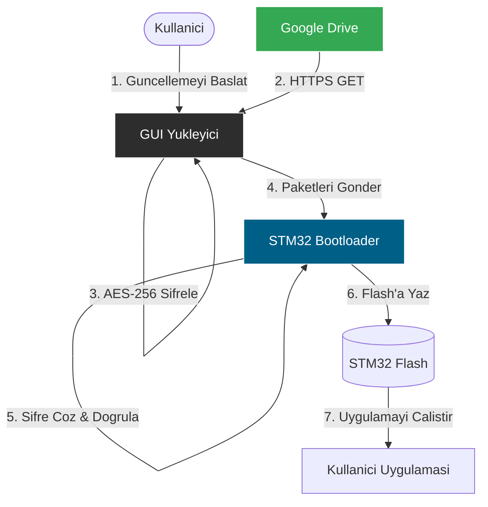

# STM32 Secure Firmware Update System

> Secure firmware update system with AES-256 encryption, CRC-32 verification, remote AES key management, and a GUI application for STM32F407VGT6 (Discovery Board).

---

## 📸 Functionality Overview (Screenshots)

### 1. Login Screen
*The application starts with a secure login to prevent unauthorized access to the configuration.*


### 2. Firmware Selection & Scanning (New)
*Users can scan the Google Drive folder to list all available firmware versions (BIN & HEX) and select the desired version from a dropdown menu.*


### 3. Admin Panel & Settings
*Authenticated users can configure AES keys, Google Drive File IDs, and update the STM32's internal key remotely.*


---

## Table of Contents / Icindekiler

- [English](#english)
- [Turkce](#turkce)

---

# English

## Project Overview

This project provides a complete system for securely updating firmware on STM32 microcontrollers over UART. It consists of three main components:

| Component | Description |
|-----------|-------------|
| **Custom Bootloader** (C) | Receives, verifies, decrypts, and flashes firmware. Manages AES key storage. |
| **Python Uploader** (PC) | Scans Google Drive for firmware versions (BIN/HEX), converts HEX to BIN, encrypts, and flashes over UART. |
| **GUI Application** (Tkinter) | Standalone .exe with admin panel, encrypted config, and remote key management. |

## 🔄 System Flowcharts

### 1. High-Level System Architecture



### 2. Firmware Update Logic (Bootloader)



## ⚙️ Working Schemes and Protocols

### 1. Bootloader Startup Logic
The STM32 determines whether to enter update mode or jump to the user application during the reset phase.

| Condition | Action | LED Status |
|-----------|--------|------------|
| PA0 Button Pressed (HIGH) | Enter Bootloader Menu | PB7 ON (Active) |
| PA0 Button Released (LOW) | Jump to Application (0x08008000) | No Boot LED |

### 2. Firmware Update Protocol (W Command)

| Step | Initiator | Data Sent | Purpose | Response |
|------|-----------|-----------|---------|----------|
| 1 | PC | 0x57 ('W') | Start Update Request | 0x06 (ACK) |
| 2 | PC | Metadata (12B) | Send Size, Version, Full CRC | 0x06 (ACK) |
| 3 | STM32 | - | Erase Application Flash (Sectors 2-7) | 0x06 (ACK) |
| 4 | PC | Packet (148B) | [IV:16][Enc:128][CRC:4] | 0x06 (ACK) / 0x15 (NACK) |
| 5 | PC | - | Repeat Step 4 for all packets | - |
| 6 | STM32 | - | Final CRC Verification | 0x06 (ACK) / 0x15 (NACK) |
| 7 | STM32 | - | Save version to Flash and Jump to App | - |

### 3. Secure Key Update Protocol (K Command)

| Step | Initiator | Data Sent | Purpose | Response |
|------|-----------|-----------|---------|----------|
| 1 | PC | 0x4B ('K') | Start Key Update Request | 0x06 (ACK) |
| 2 | PC | Key Packet (68B) | [IV:16][Enc_NewKey:48][CRC:4] | - |
| 3 | STM32 | - | Decrypt with CURRENT key | - |
| 4 | STM32 | - | Verify 0xA5A5A5A5 Magic Value | 0x06 (ACK) / 0x15 (NACK) |
| 5 | STM32 | - | Erase Sector 1 and Save New Key | - |

## 💻 Key Code Implementation

### 1. STM32: Main Bootloader Packet Loop
The bootloader acts as a secure state machine. It receives encrypted chunks, verifies integrity *before* decryption, and validates flash writes *immediately*.

```c
// Bootloader_Handle_Secure_Write: Core Packet Handling
while(1) {
    // Receive 148 bytes: [IV:16][Encrypted:128][CRC:4]
    status = HAL_UART_Receive(&huart2, rx_buffer, 148, 10000); 
    if (status == HAL_OK) {
        // 1. Verify CRC-32 (on ciphertext)
        // Critical: Do not decrypt if data is corrupted
        uint32_t computed_crc = Calculate_CRC32(encrypted_ptr, 128);
        if (computed_crc != received_crc) {
            HAL_UART_Transmit(&huart2, &nack, 1, 100);
            continue;
        }
        
        // 2. Decrypt with AES-256-CBC
        // Uses the IV from the start of the packet
        AES_init_ctx_iv(&ctx, AES_KEY, iv_ptr);
        AES_CBC_decrypt_buffer(&ctx, encrypted_ptr, 128);
        
        // 3. Write to Flash + Read-back Verification
        HAL_FLASH_Unlock();
        for (int i = 0; i < 128; i += 4) {
            uint32_t data = *(uint32_t*)(&encrypted_ptr[i]);
            HAL_FLASH_Program(FLASH_TYPEPROGRAM_WORD, current_addr, data);
            
            // Safety Check: Did it write correctly?
            if (*(volatile uint32_t*)current_addr != data) { 
                flash_error = 2; break; 
            }
            current_addr += 4;
        }
        HAL_FLASH_Lock();
        HAL_UART_Transmit(&huart2, &ack, 1, 100);
    }
}
```

### 2. STM32: Secure Remote Key Update
Allows updating the AES key stored in Sector 1. The security relies on the **Magic Value (0xA5A5A5A5)** which can only be obtained by successfully decrypting the packet with the *current* valid key.

```c
// Bootloader_Handle_Key_Update: Remote key change logic
void Bootloader_Handle_Key_Update(void) {
    // Receive 68 bytes: [IV:16][Enc(NewKey+Magic+Pad):48][CRC:4]
    HAL_UART_Receive(&huart2, rx_buf, 68, 10000);
    
    // 1. Decrypt with CURRENT key
    AES_init_ctx_iv(&ctx, AES_KEY, iv_ptr);
    AES_CBC_decrypt_buffer(&ctx, encrypted_ptr, 48);
    
    // 2. Verify Magic Value (Authentication)
    // Only someone with the current key could generate this valid payload
    if (*(uint32_t*)(&encrypted_ptr[32]) == 0xA5A5A5A5) {
        // 3. Save new key to Flash Sector 1
        save_key_to_flash(new_key);
        memcpy(AES_KEY, new_key, 32); // Switch to new key immediately
    }
}
```

## Security Layers

| Layer | Protection | Method |
|-------|-----------|--------|
| Encryption | Firmware confidentiality | AES-256-CBC with random IV per packet |
| Integrity | Transport reliability | CRC-32 on encrypted payload |
| Validation | Binary sanity | MSP check (0x2000xxxx range) |
| Key Transfer | Key confidentiality | New key encrypted with current key |
| Key Auth | Unauthorized changes | 0xA5A5A5A5 magic verification |
| Key Storage | Flash integrity | Magic marker + CRC-32 |
| Config | Settings protection | AES-256 encrypted config with PBKDF2 |

## Flash Memory Map

STM32F407VGT6 - 1 MB Flash

```
  0x08000000  +-------------------------+
              |  BOOTLOADER (16 KB)     |  Sector 0
  0x08004000  +-------------------------+
              |  KEY STORAGE (16 KB)    |  Sector 1
  0x08008000  +-------------------------+
              |                         |
              |  APPLICATION AREA       |  Sectors 2-7
              |                         |
  0x080FFFFF  +-------------------------+
```

## 🛠 Troubleshooting

- **Application Disappears/Crashes:** If the app closes immediately after starting or minimizing, check the `crash_log.txt` file in the same directory.
- **No Console Output:** Since the application runs in no-console mode, standard output is redirected to `application.log`. Check this file for runtime errors.
- **Drive API Errors:** Ensure `service_account.json` is valid and the Google Drive folder ID is correct.

---

# Turkce

## 📸 Ekran Goruntuleri

### 1. Giris Ekrani
*Uygulama, yapilandirmanin yetkisiz erisimden korunmasi icin guvenli bir giris ekrani ile baslar.*


### 2. Firmware Seçimi ve Tarama (Yeni)
*Kullanıcılar Google Drive klasörünü tarayarak mevcut tüm firmware sürümlerini (BIN & HEX) listeleyebilir ve dropdown menüden seçim yapabilir.*


### 3. Admin Paneli & Ayarlar
*Yetkili kullanicilar AES anahtarlarini, Google Drive Dosya ID'lerini yonetebilir ve STM32'nin dahili anahtarini uzaktan guncelleyebilir.*


## 🔄 Sistem Akis Semalari

### 1. Genel Sistem Mimarisi



## ⚙️ Calisma Semalari ve Protokoller

### 1. Bootloader Baslangic Mantigi

| Kosul | Islem | LED Durumu |
|-------|-------|------------|
| PA0 Butonu Basili (HIGH) | Bootloader Menusune Gir | PB7 ACIK (Aktif) |
| PA0 Butonu Basili Degil (LOW) | Uygulamaya Atla (0x08008000) | Boot LED Kapali |

### 2. Firmware Guncelleme Protokolu (W Komutu)

| Adim | Baslatici | Gonderilen Veri | Amac | Yanit |
|------|-----------|-----------------|------|-------|
| 1 | PC | 0x57 ('W') | Guncelleme Istegi Baslat | 0x06 (ACK) |
| 2 | PC | Metadata (12B) | Boyut, Versiyon, Tum CRC | 0x06 (ACK) |
| 3 | STM32 | - | Uygulama Flash Alanini Sil (Sektor 2-7) | 0x06 (ACK) |
| 4 | PC | Paket (148B) | [IV:16][Sifreli:128][CRC:4] | 0x06 (ACK) / 0x15 (NACK) |
| 5 | PC | - | Tum paketler bitene kadar Adim 4'u tekrarla | - |
| 6 | STM32 | - | Final CRC Dogrulamasi | 0x06 (ACK) / 0x15 (NACK) |
| 7 | STM32 | - | Versiyonu kaydet ve Uygulamaya Atla | - |

### 3. Guvenli Anahtar Guncelleme Protokolu (K Komutu)

| Adim | Baslatici | Gonderilen Veri | Amac | Yanit |
|------|-----------|-----------------|------|-------|
| 1 | PC | 0x4B ('K') | Anahtar Guncelleme Istegi Baslat | 0x06 (ACK) |
| 2 | PC | Anahtar Paketi (68B) | [IV:16][Sifreli_YeniAnahtar:48][CRC:4] | - |
| 3 | STM32 | - | MEVCUT anahtar ile sifreyi coz | - |
| 4 | STM32 | - | 0xA5A5A5A5 Magic Degerini Dogrula | 0x06 (ACK) / 0x15 (NACK) |
| 5 | STM32 | - | Sektor 1'i sil ve Yeni Anahtari Kaydet | - |

## 💻 Onemli Kod Bloklari

### 1. STM32: Guvenli Paket Isleme Dongusu
Bootloader guvenli bir durum makinesi (state machine) gibi calisir. Sifreli parcalari alir, butunlugu *sifre cozmeden once* dogrular ve flash yazimini *aninda* kontrol eder.

```c
// Bootloader_Handle_Secure_Write: Temel Paket Isleme
while(1) {
    // 148 byte al: [IV:16][Encrypted:128][CRC:4]
    status = HAL_UART_Receive(&huart2, rx_buffer, 148, 10000); 
    if (status == HAL_OK) {
        // 1. CRC-32 Dogrulamasi (Sifreli veri uzerinden)
        // Kritik: Veri bozuksa asla şifre çözmeye çalışma
        uint32_t computed_crc = Calculate_CRC32(encrypted_ptr, 128);
        if (computed_crc != received_crc) {
            HAL_UART_Transmit(&huart2, &nack, 1, 100);
            continue;
        }
        
        // 2. AES-256-CBC ile Sifre Cozme
        // Paketin basindaki IV kullanilir
        AES_init_ctx_iv(&ctx, AES_KEY, iv_ptr);
        AES_CBC_decrypt_buffer(&ctx, encrypted_ptr, 128);
        
        // 3. Flash Yazma + Geri Okuma Dogrulamasi
        HAL_FLASH_Unlock();
        for (int i = 0; i < 128; i += 4) {
            uint32_t data = *(uint32_t*)(&encrypted_ptr[i]);
            HAL_FLASH_Program(FLASH_TYPEPROGRAM_WORD, current_addr, data);
            
            // Guvenlik Kontrolu: Dogru yazildi mi?
            if (*(volatile uint32_t*)current_addr != data) { 
                flash_error = 2; break; 
            }
            current_addr += 4;
        }
        HAL_FLASH_Lock();
        HAL_UART_Transmit(&huart2, &ack, 1, 100);
    }
}
```

### 2. STM32: Uzaktan Guvenli Anahtar Guncelleme
Guvenlik, yalnizca *gecerli mevcut anahtarla* cozulebilen **Magic Deger (0xA5A5A5A5)** dogrulamasina dayanir.

```c
// Bootloader_Handle_Key_Update: Uzaktan anahtar degistirme mantigi
void Bootloader_Handle_Key_Update(void) {
    // 68 byte al: [IV:16][Enc(NewKey+Magic+Pad):48][CRC:4]
    HAL_UART_Receive(&huart2, rx_buf, 68, 10000);
    
    // 1. MEVCUT anahtar ile coz
    AES_init_ctx_iv(&ctx, AES_KEY, iv_ptr);
    AES_CBC_decrypt_buffer(&ctx, encrypted_ptr, 48);
    
    // 2. Magic Deger (Yetki) Kontrolu
    // Sadece mevcut anahtari bilen biri bu paketi olusturabilir
    if (*(uint32_t*)(&encrypted_ptr[32]) == 0xA5A5A5A5) {
        // 3. Yeni anahtari Flash Sektor 1'e kaydet
        save_key_to_flash(new_key);
        memcpy(AES_KEY, new_key, 32); // Hemen yeni anahtara gec
    }
}
```

## Guvenlik Katmanlari

| Katman | Koruma | Yontem |
|--------|-------|--------|
| Sifreleme | Yazilim gizliligi | Paket basina rastgele IV ile AES-256-CBC |
| Butunluk | Veri iletimi | Sifreli veri uzerinden CRC-32 |
| Dogrulama | Binary sagligi | MSP kontrolü (0x2000xxxx araligi) |
| Anahtar Aktarimi | Anahtar gizliligi | Yeni anahtar mevcut anahtar ile sifreli gonderilir |
| Yetki | Yetkisiz degisiklik | 0xA5A5A5A5 magic dogrulamasi |
| Anahtar Depolama | Flash butunlugu | Magic marker + CRC-32 |
| Yapilandirma | Ayar korumasi | PBKDF2 ile AES-256 sifreli dosya |

## Flash Bellek Haritasi

STM32F407VGT6 - 1 MB Flash

```
  0x08000000  +-------------------------+
              |  BOOTLOADER (16 KB)     |  Sektor 0
  0x08004000  +-------------------------+
              |  ANAHTAR DEPOSU (16 KB) |  Sektor 1
  0x08008000  +-------------------------+
              |                         |
              |  UYGULAMA ALANI         |  Sektor 2-7
              |                         |
  0x080FFFFF  +-------------------------+
```

## Kurulum ve Kullanim

1. **Bootloader'ı Yukle:** Custom bootloader projesini STM32CubeIDE ile build edin ve flashlayin.
2. **GUI Uygulamasını Calistir:** `Uploader/dist/FirmwareUpdater.exe` dosyasini calistirin.
3. **Admin Girisi:** Ilk acilista admin sifrenizi belirleyin.
4. **Ayarlar:** AES Anahtari, Drive ID ve Port ayarlarini girip "Sifreli Kaydet"e basin.
5. **Guncelleme:** STM32'yi PA0 butonuyla boot moduna alip guncellemeyi baslatin.

## 🛠 Sorun Giderme

- **Uygulama Kapanıyor/Kayboluyor:** Uygulama açıldıktan veya küçültüldükten sonra kapanıyorsa, aynı dizindeki `crash_log.txt` dosyasını kontrol edin.
- **Konsol Çıktısı Yok:** Uygulama konsolsuz modda çalıştığı için standart çıktılar `application.log` dosyasına kaydedilir. Çalışma zamanı hataları için bu dosyayı inceleyin.
- **Drive API Hataları:** `service_account.json` dosyasının geçerli olduğundan ve Google Drive Klasör ID'sinin doğru olduğundan emin olun.

---

*Not: Guvenlik icin STM32 uzerinde Read Protection (RDP Level 1) etkinlestirilmesi onerilir.*
